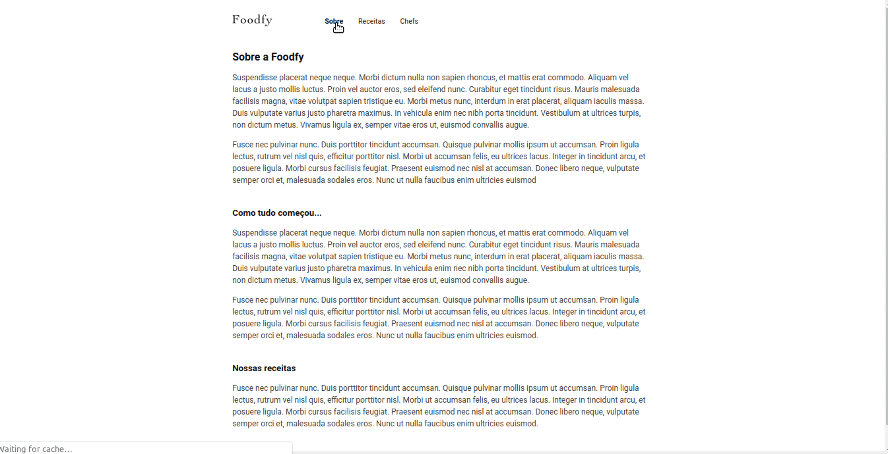
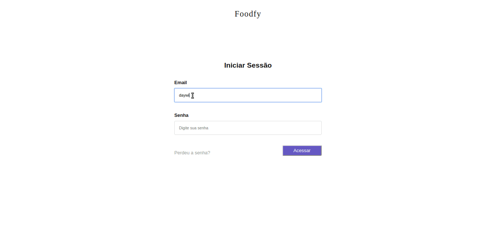

### site
<h1>
  
</h1>

### Painel admin
<h1>
  
</h1>

# Indice
- [Sobre](#sobre)
- [Tecnologias utilizadas](#tecnologias-utilizadas)
- [Como baixar o projeto](#como-baixar-o-projeto)

##  Sobre
O projeto Foodfy é um gerenciador de receitas com painel admin criado dentro do curso Bootcamp LaunchBase com intuito de colocarmos em prática as tecnologias estudadas durante o curso.

---

## Tecnologias utilizadas
O projeto foi desenvolvido utilizando as seguintes tecnologias.

- HTML5
- CSS3
- Javascript
- NodeJS
- Postgres
- Nunjucks

---

## Como baixar o projeto

```bash

  # Clonar o repositório
  $ git clone https://github.com/DaywisonFerreira/Foodfy.git
  
  # Entrar no diretório
  $ cd Foodfy

  # Instalar as dependências
  $ npm install

  # Configurar a conexão com o banco de dados e a configuração do servidor de email no arquivo .env

  # Iniciar o projeto
  $ npm start

```

---

Desenvolvido por Daywison Leal
